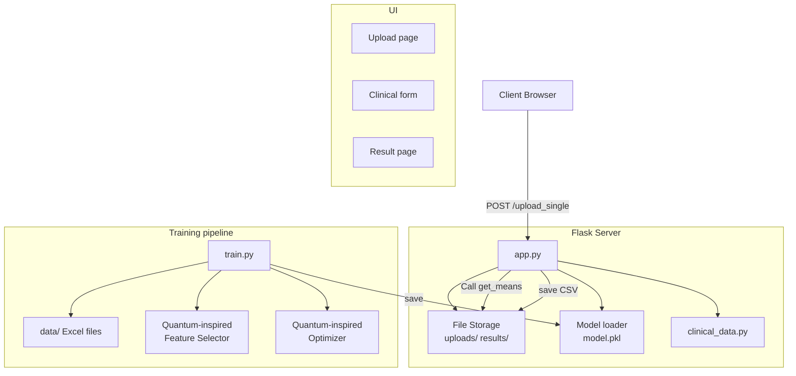

# System Architecture — Depression Detection App

This document describes the system architecture and the runtime working flow of the Depression Detection web application. It includes a high-level diagram, component descriptions, data contracts, sequence of operations (upload → prediction), and notes on security, scaling and monitoring.

---

## High-level ASCII diagram

Client (Browser)
  ├─ Upload UI (index.html) / Clinical form (clinical_form.html)
  └─ Results UI (single_result.html)
        |
        | HTTP (POST /upload_single, POST /process_data, POST /api/upload_single)
        v
Flask Web App (app.py)
  ├─ File handling (uploads/)
  ├─ Preprocessing (get_means)
  ├─ Clinical lookup (clinical_data.py) & form handling
  ├─ Model inference (model.pkl via joblib)
  ├─ Result persistence (results/*.csv)
  └─ REST API endpoints
        |
        v
Training Pipeline (train.py)
  ├─ Data loader (data/*.xlsx)
  ├─ Feature engineering (EEG mean features + clinical features)
  ├─ Quantum-inspired feature selector & optimizer (optional)
  ├─ Classical ML pipelines (SVM, RF, KNN, NB), GridSearch & CV
  └─ Save best model → model.pkl

Storage: uploads/, data/, results/, model.pkl

---

## Mermaid diagram (for editable diagrams / slide insertion)



---

## System architecture flowchart (expanded)

The diagram below expands the previous high-level view to show optional production components (model server, object storage, job queue) and monitoring. Use the Mermaid block to render an editable diagram; an ASCII fallback follows for plain-text viewing.

```mermaid
flowchart LR
  %% Clients
  Browser[Client Browser]
  Mobile[Mobile App]

  %% Frontend/UI
  subgraph Frontend[Web UI]
    Upload[Upload page<br/>index.html]
    Form[Clinical form<br/>clinical_form.html]
    Result[Result page<br/>single_result.html]
  end

  %% API / App
  subgraph API[Flask App (app.py)]
    Ingress[HTTP API endpoints]
    Preproc[Preprocessor<br/>get_means()]
    Session[Session store]
    Inference[Inference / Predictor]
    Pers[Persistence
      uploads/, results/]
  end

  %% Optional model server and storage
  subgraph Infra
    ModelServer[Model Service (optional)
      FastAPI / gRPC]
    ObjectStore[Object Storage
      S3 / MinIO]
    DB[Relational DB
      (audit metadata)]
    Queue[Job Queue
      Celery / RQ]
    Monitoring[Monitoring & Logging
      Prometheus / Grafana]
  end

  %% Training
  subgraph Training[Training Pipeline]
    Data[data/ (Excel files)]
    TrainScript[train.py]
    QSelector[Quantum-inspired
      Feature Selector]
    ModelStore[model artifacts
      artifacts/ model_v*.pkl]
  end

  %% Flows
  Browser -->|POST /upload_single| Ingress
  Mobile -->|POST /api/upload_single| Ingress

  Ingress --> Preproc
  Preproc --> Pers
  Preproc --> Session
  Ingress -->|prefill lookup| DB
  Inference -->|loads| ModelServer
  Inference -->|fallback loads joblib| ModelStore
  Inference --> Pers
  Inference --> DB
  Ingress --> Inference

  Training --> Data
  Training --> QSelector
  QSelector --> TrainScript
  TrainScript --> ModelStore
  TrainScript --> ObjectStore

  Pers --> ObjectStore
  Pers --> DB

  Ingress --> Queue
  Queue --> Inference

  Inference --> Monitoring
  TrainScript --> Monitoring

  ModelServer --> Monitoring
```

ASCII fallback (compact):

Client -> Flask (POST /upload_single)
Flask -> Preprocessor (get_means)
Flask -> Session / DB (prefill)
Flask -> Inference (model or model server)
Inference -> Persist (results/, uploads/) and DB
Training -> Data -> TrainScript -> Model artifacts -> ModelStore/ObjectStore

Export / render guidance

- To export the Mermaid block to SVG or PNG locally, install the `@mermaid-js/mermaid-cli` (requires Node.js):

```powershell
npm install -g @mermaid-js/mermaid-cli
# then export
mmdc -i docs/architecture.md -o docs/figures/system_architecture.svg
```

- If you prefer VS Code: use the "Markdown Preview Enhanced" or "Markdown Preview Mermaid Support" extension and use the preview export command to save as SVG/PNG.

- For publication-ready vector diagrams, paste the Mermaid source into an online editor (like Mermaid Live Editor) and export SVG, then adjust styles in Inkscape if needed.

Notes on choices in the diagram

- ModelServer is optional: for low traffic the Flask app can load `model.pkl` directly; for scale, a separate model-serving microservice allows independent scaling and faster upgrades.
- Object storage (S3/MinIO) decouples large file storage from app disk and enables horizontal scaling.
- The job queue enables asynchronous processing for long-running feature extraction or batched inference.


## Component breakdown and their responsibilities

1. Client (Browser)
   - Presents `index.html` for file upload and a responsive upload zone.
   - After upload, the server renders `clinical_form.html` prefilled (if a matching patient ID exists) or blank.
   - On submit, the client posts clinical data to `/process_data` which returns `single_result.html` showing prediction and clinical features.

2. Flask Web App (`app.py`)
   - Endpoints:
     - `GET /` : Upload page
     - `POST /upload_single` : Receives the uploaded Excel file, saves it to `uploads/`, computes EEG summary features (via `get_means()`), stores temporary state in the Flask `session`, and renders the clinical form.
     - `POST /process_data` : Reads EEG means (recomputed for safety), reads clinical form inputs, constructs feature vector (3 EEG means + 9 clinical), runs model inference, saves a CSV in `results/`, and renders `single_result.html`.
     - `POST /api/upload_single` : Programmatic API endpoint for automation; requires filename to contain patient ID to lookup clinical features or accepts explicit clinical fields.
     - `GET /download/<fn>` : Download saved CSV result.
   - Key functions:
     - `get_means(path)` : Reads Excel and computes first three numeric-column means; pads missing channels with zeros and returns channel names and numeric means.
     - `get_clinical_features(patient_id)` : Reads clinical features from `clinical_data.py` (age, gender, education, phq9, ctq, les, ssrs, gad7, psqi) and returns as numpy array.
     - Model loading via joblib: `model = joblib.load('model.pkl')` at startup.
   - Error handling: exceptions are logged and `error.html` is returned with the message.
   - Persistence: saves results and uploaded files; session storage used for short-lived state.

3. Training Pipeline (`train.py`)
   - Purpose: Build models from `data/` and produce `model.pkl` for inference.
   - Steps:
     - Load labeled Excel files and match patient IDs to the `mapping` (MDD/HC labels).
     - Extract EEG features (3 channel means) and clinical features (from `clinical_data.py`).
     - Optionally run the `QuantumInspiredFeatureSelector` to reduce dimensionality.
     - Optionally run `QuantumInspiredOptimizer` (a differential-evolution wrapper) to tune SVM hyperparameters.
     - Train classical models (SVM, RF, KNN, GaussianNB) with GridSearchCV or cross-validation, then build a soft `VotingClassifier` ensemble.
     - Save the chosen model to `model.pkl` using joblib.

4. Storage
   - `uploads/` : saved uploaded Excel files (used for reprocessing/repeatable audits).
   - `results/` : saved CSV outputs (timestamped) for audits and later analysis.
   - `model.pkl` : serialized scikit-learn model used by inference endpoints.
   - `data/` : raw dataset used for training.
   - `clinical_data.py` : canonical mapping of patient IDs → clinical features (used for prefill and programmatic API calls).

---

## Data contracts and feature vector shape

- EEG feature vector: [ch1_mean, ch2_mean, ch3_mean]  (3 floats)
- Clinical vector: [age, gender, education, phq9, ctq, les, ssrs, gad7, psqi]  (9 numbers)
- Combined feature vector (input to model): length 12 (float array)

Note: The server enforces numeric ranges at the HTML form level (e.g., PHQ-9 0–27) but runtime validation is performed in `process_data` by casting to float.

---

## Sequence: Upload → Predict (detailed)

1. User chooses an Excel file on the upload page and clicks Analyze.
2. Browser POSTs multipart/form-data to `POST /upload_single`.
3. Flask receives file, validates extension, secures filename and writes the file to `uploads/` with a timestamped name.
4. Flask calls `get_means(saved_path)` to compute EEG means and channel names. It stores `session['eeg_means']`, `session['eeg_channels']` and `session['temp_file']` for continuity.
5. Flask checks `clinical_data.py` to see if the filename contains a patient ID; if so, fetches clinical data and prepares `prefill` for the clinical form.
6. Server renders `clinical_form.html` with hidden `temp_file` and prefilled values (if present).
7. User reviews/edits clinical fields and submits the form to `POST /process_data`.
8. Flask re-reads file (from `temp_file`) and recomputes EEG means to be safe.
9. Flask reads clinical inputs, constructs the 12-length feature vector, and casts to float.
10. Flask calls `model.predict(X)` and `model.predict_proba(X)` (if supported) to compute label and probability.
11. Flask writes a timestamped CSV to `results/` with the uploaded filename, channel means, clinical fields, predicted label and probability.
12. Flask renders `single_result.html` showing the label, probability and a guidance block.

---

## Error handling and re-runability

- If `get_means()` fails (no numeric columns), server returns `error.html` asking the user to reformat their file.
- If `model.pkl` is missing or corrupt, endpoints return a readable error recommending running `train.py`.
- Temporary uploaded files are preserved for reproducibility. A cleanup job (cron or manual) can remove old files.

---

## Security considerations

- File uploads: filenames are sanitized with `werkzeug.utils.secure_filename()`; restrict allowed extensions to `.xls`/`.xlsx`.
- Avoid executing arbitrary code from uploaded files — `get_means()` only uses pandas to read Excel, but you should validate content further if the app becomes public.
- Secrets: `app.secret_key` currently uses `os.urandom(24)` at runtime; in production use a fixed secret pulled from environment or a secret manager.
- Model file integrity: consider checksum or signature validation of `model.pkl` before loading.
- Rate limiting and authentication: add API keys or user auth for `/api/upload_single` before exposing the endpoint.

---

## Scaling and deployment notes

- Single-server dev deployment: `python app.py` with built-in Flask server (not suitable for production).
- Production recommendation: Use a WSGI server (gunicorn/uvicorn) behind a reverse proxy (nginx). Run multiple worker processes and leverage shared storage for `uploads/` and `results/` (e.g., mounted network drive or S3).
- Model serving: For high-throughput scenarios, separate inference into a model server (FastAPI, TorchServe, or a dedicated microservice) and call it via HTTP/gRPC from the Flask frontend.
- Containerize the app (Docker) and provide `docker-compose` for local testing. For cloud, consider Kubernetes for autoscaling and rolling updates.

---

## Monitoring, logging and reproducibility

- Logs: server.log already exists; ensure logs include request IDs and correlation IDs for tracing.
- Metrics: instrument endpoints for request count, latency, error rate, and model inference time. Export to Prometheus and visualize in Grafana.
- Model versioning: tag saved models (e.g., `model_v1.0_YYYYMMDD.pkl`) and keep training artifacts (training logs, CV splits, best params) in `artifacts/` for reproducibility.
- Auditing: store `results/` CSVs with enough metadata (uploader ID, timestamp, model version) to reproduce any prediction.

---

## Files to include in documentation/repository

- `docs/architecture.md` (this file)
- `docs/figures/system_architecture.svg` (vector diagram export of the mermaid or Visio/Illustrator diagram)
- `docker/Dockerfile` and `docker/docker-compose.yml` (optional)
- `artifacts/` (training logs, best params, dataset splits)

---

## Quick design choices & rationale

- Two-step upload (EEG → clinical form) prevents feature-mismatch and gives the user a chance to correct clinical inputs.
- Keep inference synchronous for now (quick model) to simplify UX; move to async job queue (Redis/RQ or Celery) if inference becomes slow.
- Retain uploaded files to support auditing and retraining.

---

## Next actions (recommended)

1. Export the mermaid diagram to `docs/figures/system_architecture.svg` and add to the paper figures.
2. Add an `architecture` section to the main `README.md` linking to this file.
3. Add CI steps to run basic health checks (model loads, endpoints respond) before merging new code.


---

End of architecture document.
